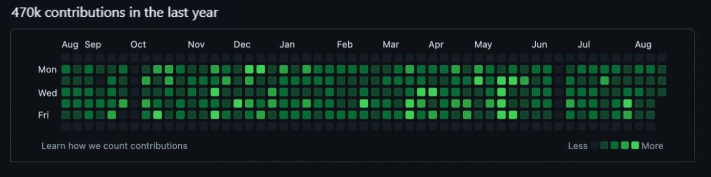

# 💚 Fancy GitHub Commits Generator

Make your GitHub contribution graph look like a beautiful forest of **green squares** 🌳🌳🌳 by generating backdated commits with style!



---

## ✨ Features

- 🕒 Backdated commits using custom dates
- 🌿 Multiple commits per day = deeper green colors!
- 🎲 Random commit distribution across the year
- 📅 Custom number of commits (you choose!)
- 📦 Easy to use — just run the script

---

## 📸 How It Works (Visual Guide)

1. **Pick a number** of commits to make:
   ```
   How many commits do you want to make? (Default: 100):
   ```

2. ✍️ The script:
   - Picks random dates from the past year
   - Makes **1–5 commits** per chosen day
   - Uses custom dates for commit history
   - Pushes everything to your GitHub!

3. ✅ You get something like this:
   

---

## ⚙️ Setup Instructions

### 1. Clone the Repo
```bash
git clone https://github.com/vishnu1100/FancyGithubGraphCommits.git
cd FancyGithubGraphCommits
```

### 2. Install Dependencies
```bash
npm install jsonfile moment simple-git random
```

### 3. Initialize a Git Repo (if not already)
```bash
git init
git remote add origin https://github.com/your-username/your-repo.git
```

### 4. Run the Script
```bash
node commit.js
```

Then, follow the prompt to enter how many commits you want.

---

## 🧠 Behind the Scenes

- `moment`: Handles date generation
- `simple-git`: Executes Git commands from Node.js
- `random`: Picks random weeks and days
- `jsonfile`: Writes a file for Git to detect changes
- `--date`: Git allows setting fake commit dates 😏

---

## 💡 Tip for Perfect Green Grid

To fill the graph neatly:
- Run the script a few times with different commit counts
- Try 365 commits (avg. 1/day) for a full year
- Push to your **main GitHub profile repo** for best results (usually a pinned personal repo)

---

## 🔒 Disclaimer

This is just for fun or aesthetic use! Don’t use fake contributions to mislead others — use it responsibly 🙌

---

## 💖 Inspired by

- [@IonicaBizau](https://github.com/IonicaBizau/github-contributions)  
- [@SimpleGit](https://github.com/steveukx/git-js)  
- GitHub contribution graphs themselves 🟩

---

## 📸 Result Sample


---

## 📣 Star the repo if you like it ⭐

Happy Hacking! ✨
